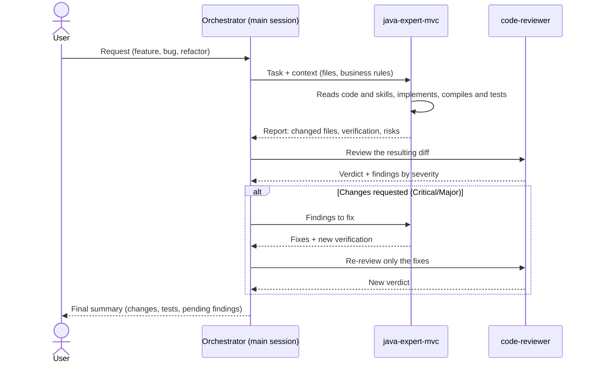

# Agent Orchestration — Backend (Spring Boot)

Agents defined in `backend/.claude/agents/`. Subagents **do not talk to each other**: the main Claude Code session acts as the orchestrator. It launches each agent, receives its report, and decides the next step by passing the previous agent's output to the next one.

## Agents

### 1. `java-expert-mvc` — Implementer

**Task:** write, refactor and fix backend code in a layered MVC architecture (Controller → Service → Repository) on modern Java and Spring Boot 4.

**Tools:** all (reads, edits, writes and runs Gradle).

**Preloaded skills:** `spring-layered-crud`, `spring-pagination`, `spring-error-handling`, `spring-security`, `spring-multi-tenancy`, `spring-custom-validator`, `java-springboot`, `java-junit`, `java-docs`.

**Functions:**
- Create complete new resources: entity, repository, DTOs (records), MapStruct mapper, service (interface + `impl`) and controller.
- Add paginated/filterable endpoints, error handling with the project's exception hierarchy, and JWT/role security (`@PreAuthorize`, ownership checks).
- Add custom Bean Validation constraints (single-field or cross-field) in `validator/`.
- Work with the multi-tenant schema (one schema per clinic) and Flyway migrations (`db/migration/public` and `db/migration/tenant`).
- Fix bugs at the root cause (checks every caller before touching a shared method).
- Write unit tests (JUnit 5 + Mockito + AssertJ) for every business rule that throws, and Javadoc on public APIs.
- Verify with `./gradlew compileJava` and the relevant tests before reporting.
- **Output:** short report with changed files (`file:line`), what was verified, and pending risks.

**Does not do (unless asked):** commit/push, change major versions or build tooling, reformat unrelated files.

### 2. `code-reviewer` — Reviewer (read-only)

**Task:** review Java/Spring Boot code and report prioritized findings. **Never modifies files.**

**Tools:** `Read`, `Grep`, `Glob`, `Bash` (read-only commands only: `git diff/log/show/status`, `./gradlew compileJava`, `./gradlew test`).

**Preloaded skills:** `spring-layered-crud`, `spring-pagination`, `spring-error-handling`, `spring-security`.

**Functions:**
- Determine scope: whatever it is given, otherwise pending changes (`git diff`), otherwise the last commit.
- Review in this order: correctness (transactions, lazy loading, race conditions, dates), SOLID, design patterns (missing and over-engineered), MVC layering, clean code, modern Java, persistence/performance (N+1, pagination, indexes), security (IDOR, `@PreAuthorize`, secrets) and tests.
- Verify each finding before reporting it, marking it `CONFIRMED` or `PLAUSIBLE`.
- **Output:** verdict (`Approve` / `Approve with nits` / `Changes requested`) and up to ~15 findings by severity (`Critical`, `Major`, `Minor`, `Nit`), each with `file:line`, problem and fix; ends with strengths and what was not reviewed.

## Available skills

| Skill                                        | Purpose                                           | Preloaded in      |
|----------------------------------------------|---------------------------------------------------|-------------------|
| `spring-layered-crud`                        | Layered structure of a resource                   | both              |
| `spring-pagination`                          | List endpoints with `Pageable`                    | both              |
| `spring-error-handling`                      | Exceptions + `@RestControllerAdvice`              | both              |
| `spring-security`                            | JWT and role-based authorization                  | both              |
| `spring-multi-tenancy`                       | Schema-per-tenant with Hibernate + Flyway         | `java-expert-mvc` |
| `spring-custom-validator`                    | Custom Bean Validation constraints (`validator/`) | `java-expert-mvc` |
| `java-springboot`, `java-junit`, `java-docs` | Best practices, tests, Javadoc                    | `java-expert-mvc` |

## Communication flow

### Flow rules

1. **Implement → review**, always in that order; the reviewer receives the diff, not the implementer's report, so it reviews without bias.
2. Only `Critical` and `Major` findings go back to the implementer. `Minor`/`Nit` are reported to the user, who decides.
3. At most **2 fix cycles**; if findings persist, escalate to the user.
4. Review only (no changes): the orchestrator calls `code-reviewer` directly.
5. Changes to the HTTP contract (DTOs, routes, status codes) must be passed to the frontend orchestrator (`frontend/ORQUESTATION.md`) so it updates `src/app/core/models` and `src/app/core/api`.
