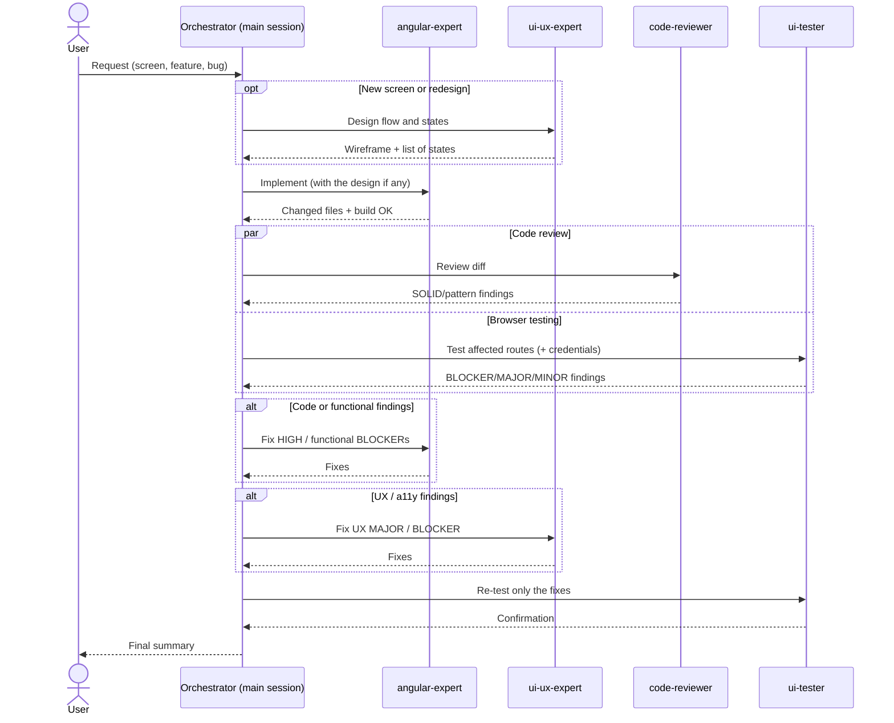

# Agent Orchestration — Frontend (Angular)

Agents defined in `frontend/.claude/agents/`. Subagents **do not talk to each other**: the main Claude Code session acts as the orchestrator. It launches each agent, receives its report, and passes the next agent what it needs.

## Agents

### 1. `angular-expert` — Implementer

**Task:** build and refactor components, pages, services, routes, forms and signal-based state, writing code valid for the exact installed Angular version (19–22).

**Tools:** `Read`, `Edit`, `Write`, `Glob`, `Grep`, `Bash`, `WebFetch`, `WebSearch`.

**Skills it follows:** `angular-project-structure`, `angular-data-services`, `glass-ui`.

**Functions:**
- Detect the `@angular/core` version in `package.json` and never use APIs from later versions.
- Create standalone components with `inject()`, signal inputs/outputs, `computed`, `@if/@for/@switch` and `OnPush`.
- Consume the backend only through the `XxxApi` classes in `src/app/core/api` and the models in `src/app/core/models`; server state via `rxResource`/`resource`.
- Lazy routes with functional guards (`core/auth/auth.guards.ts`) and interceptors (`core/http/api.interceptors.ts`).
- Typed reactive forms, accessibility basics (labels, `aria-label`, keyboard).
- Version upgrades with `ng update` and the official migrations, one major at a time.
- Verify with `ng build` (and tests if present) and `npm run format`.
- **Output:** changed files, what was verified, and version-specific notes.

### 2. `ui-ux-expert` — UX designer / implementer

**Task:** design or redesign screens and flows, review usability and accessibility (WCAG 2.2 AA), and **implement** the fixes.

**Tools:** all (including Playwright MCP when available).

**Skills it follows:** `glass-ui` and `src/styles.css` (the design system wins over personal taste).

**Functions:**
- Identify the user and the main task of the screen.
- Review in priority order: task flow, states (loading/empty/error/success), accessibility, visual hierarchy, forms, responsive (390px with no horizontal scroll), microcopy and consistency.
- Design new screens: ASCII wireframe + list of states, then build them with `glass-ui` components.
- Fix blockers and majors directly with the smallest diff; asks before large redesigns or new dependencies.
- **Output:** `severity · file:line · problem · fix` list (when reviewing) or a change report with user impact (when implementing).

### 3. `ui-tester` — Exploratory QA (does not edit code)

**Task:** use the real app through the Playwright MCP browser to find UI defects and judge them with the `ui-ux-expert` checklist.

**Tools:** `Read`, `Glob`, `Grep`, `Bash` and the `mcp__playwright__browser_*` tools (navigate, snapshot, screenshot, click, type, resize, console, network…).

**Functions:**
- Check preconditions: Playwright MCP connected, dev server at `http://localhost:4200` (starts it with `npm start` if needed), backend responding, credentials per role.
- Test each screen: happy path, unhappy paths (empty forms, double click, Esc, reload, guarded routes), states, keyboard/a11y and responsive (1440, 768 and 390 px).
- Check console and network requests after every action; any NG0xxx error or 4xx/5xx is a finding.
- **Output:** `BLOCKER` / `MAJOR` / `MINOR` findings with steps, expected vs. actual, evidence and UX criterion; a list of what passed and what couldn't be tested; if there are UX MAJOR/BLOCKER findings, it says to hand them to `ui-ux-expert`.

### 4. `code-reviewer` — Design reviewer (read-only)

**Task:** review code for SOLID principles and design patterns (correct use, misuse, and missing where it hurts). **Does not edit.**

**Tools:** `Read`, `Glob`, `Grep`, `Bash`.

**Functions:**
- Scope: whatever it is given, otherwise `git diff HEAD` + untracked files.
- Use project conventions as the baseline (`angular-project-structure`, `angular-data-services`).
- Detect SOLID violations, over-engineering (single-implementation interfaces, one-product factories), duplicated knowledge, and leaky layers (e.g. a component using `HttpClient` instead of the `core/api` layer, `core` importing from `features`).
- **Output:** up to ~15 `HIGH` / `MEDIUM` / `LOW` findings with `file:line`, problem and minimal fix, plus a 2–3 line verdict.

## Available skills

| Skill                       | Purpose                                                  | Used by                                       |
|-----------------------------|----------------------------------------------------------|-----------------------------------------------|
| `angular-project-structure` | core/shared/features/layout folders, routes, conventions | `angular-expert`, `code-reviewer`             |
| `angular-data-services`     | Models, `XxxApi`, interceptors, errors                   | `angular-expert`, `code-reviewer`             |
| `glass-ui` (+ `glass.css`)  | Glassmorphism-lite design system                         | `angular-expert`, `ui-ux-expert`, `ui-tester` |

## Communication flow

### Flow rules

1. **Design (optional) → implement → review + test in parallel → fix → re-test.**
2. Finding routing:
   - `code-reviewer` HIGH and functional bugs from `ui-tester` → `angular-expert`.
   - UX/accessibility findings from `ui-tester` → `ui-ux-expert`.
   - MEDIUM / LOW / MINOR → reported to the user, who decides.
3. `ui-tester` needs the backend running and credentials; if missing, the orchestrator reports it as a blocker instead of testing against a broken stack.
4. At most **2 fix cycles**; after that, escalate to the user.
5. If the backend changes its HTTP contract (see `backend/ORQUESTATION.md`), the orchestrator first launches `angular-expert` to update `src/app/core/models` and `src/app/core/api`, then `ui-tester` on the affected screens.
